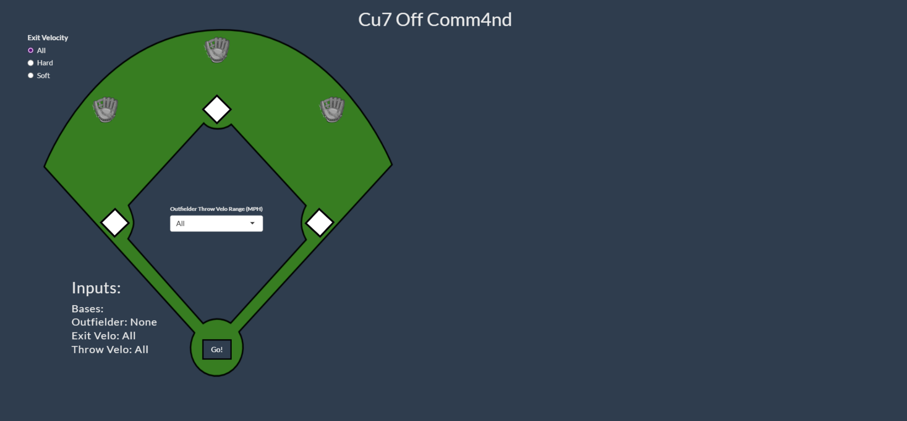
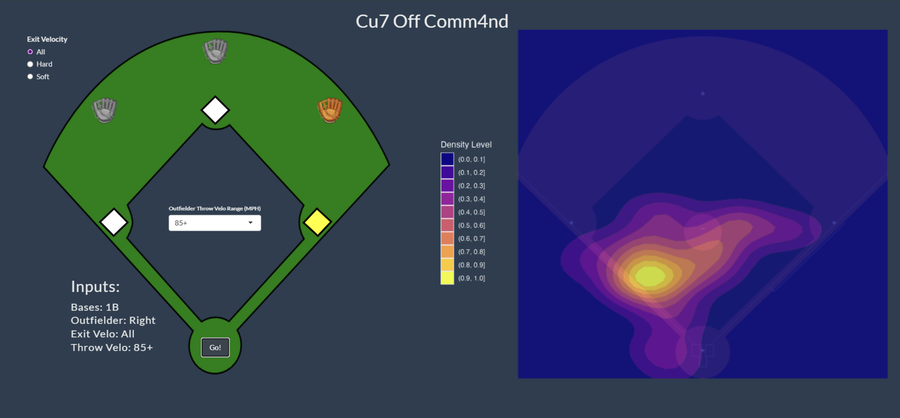

# Cut Off Command

**Interactive pitcher positioning analysis for outfield throws**

[**→ Try the live app**](https://cutoffcommand.shinyapps.io/myApp/)

## What this does

When a ball gets hit to the outfield, pitchers are supposed to back up a base. But which base? Where exactly should they stand? Most coaches don't have a good answer beyond "just back up home" or "use your instincts."

We analyzed 247 games of minor league tracking data to show where pitchers actually position themselves in different game situations. Runner on second, ball hit to right field, strong-armed outfielder? There's a heatmap for that. The tool lets you filter by base runners, outfield position, exit velocity, and throw strength to see real positioning patterns from professional games.

The name references Kenley Jansen's number 74 (Cu**7** off Comm**4**nd) and Game 4 of the 2020 World Series, where his poor positioning on a relay throw helped cost the Dodgers the game.

## Why this matters

Pitcher positioning gets almost no attention in defensive coaching, even though it can be the difference between a run scoring and an out. This gives coaches concrete data instead of vague instructions. It's also a proof of concept for how you could analyze positioning for any defensive player with tracking data.

## Features

- **Context-aware heatmaps**: Filter by base runners, outfield position, exit velocity, and throw strength
- **Mobile-optimized**: Built for dugout use on phones and tablets. Everything's tap-based, no typing required
- **Smart error handling**: Shows an alert when there isn't enough data for a specific scenario
- **204 unique scenarios** covering different game situations

## How it works

We started with tracking data captured every 50 milliseconds and built a pipeline that:
1. Pulls every outfield base hit across 247 games
2. Grabs the pitcher's position right when the outfielder releases their throw
3. Groups plays by base state, fielder position, exit velocity, and arm strength
4. Generates density heatmaps showing where pitchers actually stand

The 86 mph exit velocity cutoff came from testing different thresholds to balance having enough data per scenario while still separating hard contact from soft contact.

About 30% of possible input combinations don't have enough data to show a meaningful heatmap, but the ones that do show clear patterns.

## Tech stack

**R + Shiny** for the web app  
**ggplot2** for visualization  
**sportyR** for baseball field rendering  
**tidyverse** for data manipulation

Built entirely without AI assistance.

## Screenshots

*A look at the application when first opened*

*Heatmap showing pitcher positioning: runner on 1st, right field, all exit velocities, 85+ mph throw*

*Mobile-optimized interface*

## What we learned

First time building an actual web app from scratch. Some takeaways:
- Designing for real-world use (coaches pulling this up mid-game) made us ruthlessly simplify the UI
- Spatial tracking data at 50ms intervals is messy. Lots of edge cases to handle
- Getting the touch controls to feel natural took way more iteration than we expected

## What's next

With better data coverage, this could expand to:
- Other positions (where should the second baseman be on a fly ball to left?)
- Runner speed as a factor
- Individual outfielder arm strength instead of buckets
- Distinguishing between contact results (ground ball single vs. a double in the gap)

## About

Built for the 2025 SMT Data Challenge. We'd like to thank Meredith Wills and Billy Fryer for all of their mentorship and support throughout this process.

[Full writeup with methodology and user guide](writeup.pdf)
